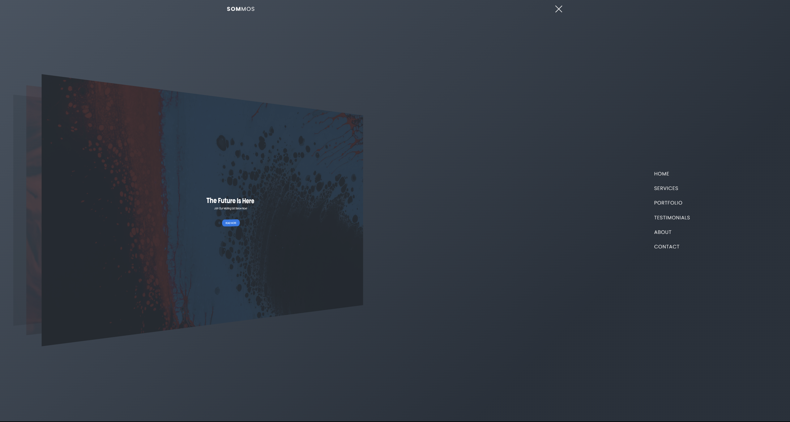

# Javascript 3D Nav Bar

    

This program builds a responsive, animated animated 3d navigation bar website in HTML, CSS & JavaScript.

This has been built into a web application accessible here: https://sommos.github.io/javascript_3d_nav_bar/

# Contribution 

If you'd like to contribute to `javascript_3d_nav_bar` please submit a pull-request on a feature branch.

# Installing

Clone the repo:

    git clone https://github.com/Sommos/javascript_3d_nav_bar
    cd javascript_3d_nav_bar
